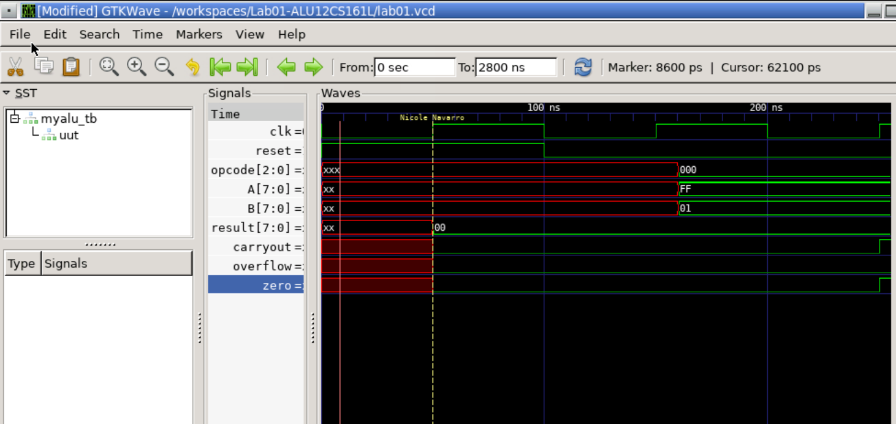

Name: Nicole Navarro
Email: nnava026@ucr.edu

Testbench Descriptions:
1.1: Unsigned Add A: 0xFF with B: 0x01. 0xFF + 0x01 = 0x100. The result should be 0x00, and therefore zero should be set to 1. The MSB's carryout is 1, so the carryout should be set to 1.

1.2: Unsigned Add A: 0xFF with B: 0xFF. 0xFF + 0xFF = 0x1FE. The result should be 0xFE, and therefore zero should be set to 0. The MSB's carryout is 1, so the carryout should be set to 1.

1.3: Unsigned Add A: 0x0D with B: 0x02. 0x0D + 0x02 = 0x0F. The result should be 0x0F, and therefore zero should be set to 0. The MSB has no carryout, so the carryout should be set to 0.

2.1: Unsigned Sub A: 0x1A - B: 0x0C. The result is 0x0E, so zero should also be set to 0. Carryout should be 0, because there was no need to borrow from a 0 at the MSB.

2.2: Unsigned Sub A: 0xAC - B: 0x54. The result is 0x58, so zero should also be set to 0. Carryout should be 0, because there was no need to borrow from a 0 at the MSB.

2.3: Unsigned Sub A: 0xFF - B: 0x01. The result is 0xFE, so zero should also be set to 0. Carryout should be 0, because there was no need to borrow from a 0 at the MSB.

3.1: Signed Add A: 0xAB + B: 0xBC. This is the same as 85 + 68 = 153, which goes over the +128 limit for an 8 bit signed system. The addition is 0x167, so the result is 0x67 which is -103. If signed adding 2 positive numbers gives a negative result, there is overflow, so overflow should be 1. Zero should be 0.

3.2: Signed Add A: 0x65 + B: 0x39. This is the same as -101 + -57 = -158, which goes over the -128 limit for an 8 bit signed system. The addition is 98 and the result is 0x9E. Zero is 0. If signed adding 2 negative numbers gives a positive result, there is overflow, so overflow should be 1.

3.3: Signed Add A: 0x10 + B: 0x13. This is the same as -16 + -19 = -35, which stays within the -128 limit for an 8 bit signed system. The addition is -35, so the result is 0x23. If signed adding 2 negative numbers gives a negative result, there is no overflow, so overflow should be 0. Zero should be 0.

4.1: Signed Sub A: 0x88 - B: 0x4A. This is the same as 120 - (-74) = 194, which goes past the +128 limit for an 8 bit signed system. The subtraction is -62, so the result is 0x3E. If signed subtracting a positive number and a negative number gives a negative solution, there is overflow, so overflow should be 0. Zero should be 0. 

4.2: Signed Sub A: 0xEF - B: 0xCD. This is the same as 17 - 51 = -34, which is within the -128 limit for an 8 bit signed system. The subtraction is -34, so the result is 0x22. The result of subtracting these 2 positive numbers gives a negative result that is within the limit of the 8 bit signed system, therefore there is no overflow, so overflow should be 0. Zero should be 0. 

4.3: Signed Sub A: 0x94 - B: 0x12. This is the same as 108 - (-18) = 126, which is within the +128 limit for an 8 bit signed system. The subtraction is 126, so the result is 0x82. If subtracting a positive and negative number gives a positive result, there is no overflow, so overflow should be 0. Zero should be 0.

5.1: AND A: 0x00 with B: 0xFF. The result should be 0x00, and because of this, zero should be 1. Overflow and Carryout do not matter.

5.2: AND A: 0xAA with B: 0xFF. The result should be 0xAA, and because of this, zero should be 0. Overflow and Carryout do not matter.

5.3: AND A: 0xCA with B: 0xAC. The result should be 0x88, and because of this, zero should be 0. Overflow and Carryout do not matter.

6.1: OR A: 0x00 with B: 0xFF. The result should be 0xFF, and because of this, zero should be 0. Overflow and Carryout do not matter.

6.2: OR A: 0x00 with B: 0x88. The result should be 0x88, and because of this, zero should be 0. Overflow and Carryout do not matter.

6.3: OR A: 0xAA with B: 0x55. The result should be 0xFF, and because of this, zero should be 0. Overflow and Carryout do not matter.

7.1: XOR A: 0x00 with B: 0xFF. The result should be 0xFF. The result isn't 0x00, so zero should be 0. Overflow and Carryout do not matter.

7.2: XOR A: 0xFF with B: 0xFF. The result should be 0x00. The result is 0x00, so zero should be 1. Overflow and Carryout do not matter.

7.3: XOR A: 0xAA with B: 0xFF. The result should be 0x55. The result isn't 0x00, so zero should be 0. Overflow and Carryout do not matter.

8.1: Divide A: 0xFF by 2, B is set to 0xFF, but B shouldn't affect anything because this operation only handles A. The result should be 0x7F. The result isn't 0, so zero should be 0. Overflow and Carryout do not matter. 

8.2: Divide A: 0x00 by 2, B is set to 0x01, but B shouldn't affect anything because this operation only handles A. The result should be 0x00. The result is 0, so zero should be 1. Overflow and Carryout do not matter.

8.3: Divide A: 0x5C by 2, B is set to 0xAB, but B shouldn't affect anything because this operation only handles A. The result should be 0x2E. The result isn't 0, so zero should be 0. Overflow and Carryout do not matter.

Waveform Screenshot:

